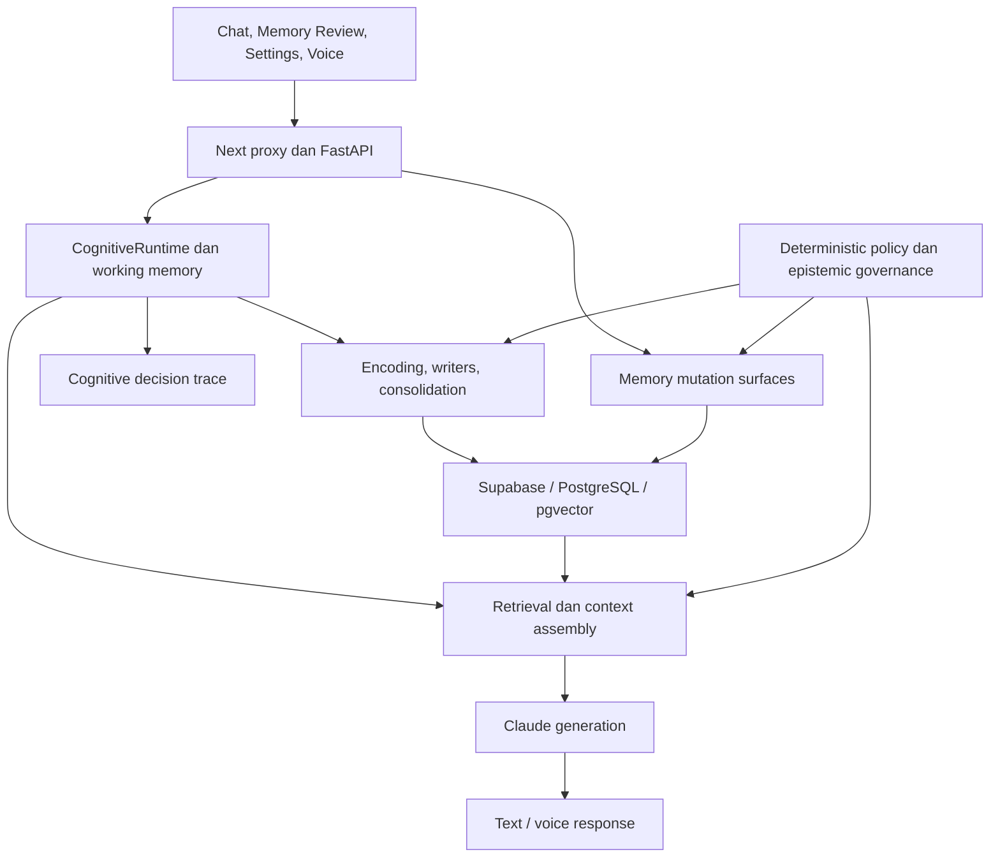
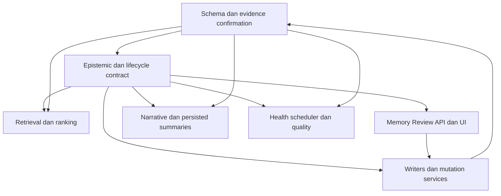

# Aliyya Project State — Current

Versi dokumen: 1.3 • Diperiksa: 6 September 2026 • Pemilik produk: Syahid Rohmatulloh

**Current milestone: Agent Core — ACTIVE, architecture contract locked. M35C3 dan Trusted Cognitive Foundation M31–M35 tetap COMPLETE / FROZEN.** Agent Core Phase 0 repository dan live-schema audit telah selesai secara read-only. `docs/AGENT_CORE_ARCHITECTURE_ADR.md` sekarang menjadi canonical architecture contract untuk pemisahan Memory, Goals, Agent Objectives, plans, steps, observations, verification, continuation, dan future external-action authority. Agent Core architecture baseline adalah `43b3798643a2f93bd20d682b6d33a7baaf905c23`. Belum ada Agent Core runtime mutation atau production migration.

## 1. Sumber, batas verifikasi, dan aturan pembaruan

Sumber utama: brief pengguna `Pasted text(20260905-040728).txt`; metadata branch dan riwayat commit GitHub; tree repository lengkap (559 entries, tidak terpotong); serta file kode, SQL, UI, dan dokumentasi yang dicantumkan pada register bukti di akhir dokumen. Semua pembacaan kode dipatok ke baseline di atas.

Label bukti:

- **OBSERVED**: terlihat langsung pada snapshot repository, bukan bukti perilaku production.
- **DOCUMENTED**: dinyatakan oleh brief atau dokumen repository, belum diuji ulang di sesi ini.
- **PROPOSED**: rekomendasi untuk desain M35C3, belum menjadi kontrak implementasi.
- **UNVERIFIED**: memerlukan checkout, pengujian, akses schema aktual, atau bukti deployment.

Update final 6 September 2026: exact checkout lokal `/Users/syahidrohmatulloh/my-assistant` diverifikasi pada branch `main` dengan runtime/code anchor `29134ccff2db04feb4d17ea44f69344b3eeb1e44`, local/remote telah sinkron, dan working tree bersih sebelum freeze documentation. M35C3 telah melalui consolidated implementation, regression, Phase 424 production migration, backend Fly.io deployment, frontend Vercel deployment, dan production smoke test. Evidence final dicatat pada bagian completion record dan Definition of Done.

Aturan canonical state: kode pada commit terverifikasi menjelaskan implementasi repository; schema aktual menjelaskan keadaan database; artefak deployment menjelaskan production; brief menetapkan visi dan batas produk. Salah satu tidak boleh dijadikan pengganti bukti yang lain. Jika implementasi melanggar invariant, catat sebagai gap yang harus diperbaiki—jangan mengubah invariant agar sesuai bug.

Setiap pembaruan dokumen harus mencatat tanggal, full SHA, branch, keadaan working tree, sumber bukti baru, discrepancy, keputusan yang berubah, hasil gate, dan status milestone. Status COMPLETE memerlukan bukti, bukan hanya perubahan judul. Dokumen ini menjadi living project document; tidak mengubah ADR historis secara retrospektif.

## 2. Product vision

### Canonical Product Definition — LOCKED

> **Aliyya is a persistent Personal & Executive AI Agent — a trusted cognitive layer between the user and their personal, professional, and digital world.**

Aliyya bukan sekadar chatbot, productivity app, atau personal assistant dengan memory. Target akhirnya adalah satu persistent AI agent yang memahami user dan dunianya, menjaga continuity lintas waktu, bernalar di bawah uncertainty, mengelola goals dan commitments yang persisten, menggunakan tools dalam authority boundary yang eksplisit, melakukan serta memverifikasi tindakan nyata, memonitor outcome, melakukan follow-up secara proaktif, dan belajar secara aman dari feedback user.

**Personal Assistant dan Executive Assistant bukan dua produk terpisah.** Keduanya adalah dua operating context dari cognitive system Aliyya yang sama:

- **Personal context:** identity, family, preferences, routines, personal goals, life context, communication style, dan companion relationship.
- **Executive context:** people, organizations, projects/deals, meetings, email, documents, commitments, decisions, deadlines, follow-ups, dan priorities.

Aliyya harus tetap tampil sebagai **satu persona dan satu relationship** dengan user, walaupun arsitektur internalnya kelak dapat mengorkestrasi banyak specialist agents, models, tools, dan workflows.

### Canonical capability loop

```text
PERCEIVE
→ UNDERSTAND
→ RECALL
→ PLAN
→ CHECK AUTHORITY
→ ACT
→ OBSERVE
→ VERIFY
→ UPDATE STATE
→ FOLLOW UP
→ ADAPT
```

Setiap major development setelah M35 harus secara material meningkatkan minimal satu capability berikut:

```text
UNDERSTAND
REMEMBER
PLAN
ACT
ADAPT
```

Jika sebuah development tidak jelas meningkatkan salah satu capability di atas, prioritasnya harus dipertanyakan sebelum masuk roadmap.

### Long-term product direction

Aliyya berkembang dari **trusted cognitive foundation** menuju **agent intelligence**:

- memahami user dan dunia personal/profesionalnya;
- menyimpan knowledge dengan provenance dan uncertainty yang benar;
- mengelola objectives, plans, commitments, actions, dan follow-up lintas waktu;
- menggunakan tools dengan permission, approval, reversibility, dan audit trail;
- melakukan monitoring dan verification terhadap outcome;
- menjadi proactive tanpa kehilangan user control;
- berkembang menuju realtime multimodal interaction;
- mengorkestrasi specialist agents di belakang satu persona Aliyya;
- akhirnya dapat berinteraksi dengan external world dan agent lain melalui disclosure/policy gate yang ketat.

North star jangka panjang adalah **AI World**, tetapi implementasinya berada di luar scope sekarang. Prinsip tetap:

> “M31 = build the mind. AI World = let that mind enter society.”

Public agent context hanya boleh menerima informasi melalui disclosure/policy gate dari private memory, dengan isolasi, kontrol disclosure, dan persona publik yang eksplisit.

## 3. Current architecture

| Lapisan | Baseline canonical saat ini | Bukti / batas |
|---|---|---|
| Repository | `syahidrohmatulloh/My-Personal-Assistant`, branch `main` | M35C3 runtime/code freeze anchor `29134ccff2db04feb4d17ea44f69344b3eeb1e44` |
| Frontend | Next.js **15.5.18**, React **19.2.6**, React Query, Tailwind, pnpm | OBSERVED lockfile; manifest Next `^15.0.0`, React `^19.0.0` |
| Frontend hosting | Vercel | PRODUCTION VERIFIED; M35C3 frontend build dari `29134cc` live |
| Backend | FastAPI / Python | OBSERVED entrypoint dan router |
| Backend hosting | Fly.io | PRODUCTION VERIFIED; rolling deployment M35C3 sehat pada dua machine dan `/health` mengembalikan `status=ok` |
| Durable state | Supabase / PostgreSQL / pgvector | LIVE VERIFIED; Phase 424 applied, canonical confirmation columns dan guarded `match_memories` aktif |
| Cognition | `CognitiveRuntime`, working memory, decision trace, metacognition, attention, habit learning, consolidation, calendar policy | OBSERVED runtime facade dan dependency-nya; bukan audit setiap algoritme |
| Memory governance | `memory_epistemic_governance.py` + `memory_lifecycle_governance.py` | M35C3 FROZEN; authority menggunakan canonical user confirmation, legacy `last_confirmed_at` historical-only |
| AI dan integrasi | Anthropic Claude, VoyageAI embeddings, ElevenLabs TTS, Deepgram STT, Google Calendar OAuth | Baseline integrasi DOCUMENTED; konfigurasi/konektivitas live belum diverifikasi |

**Koreksi stack:** brief menyebut Next.js 16, tetapi manifest dan lockfile pada baseline menunjukkan Next.js 15.5.18. Gunakan versi repository sebagai canonical untuk pekerjaan berikutnya; upgrade framework bukan scope M35C3.

Architecture map berikut adalah hubungan tanggung jawab, bukan urutan eksekusi serial. Reads dapat paralel dan encoding dapat deferred.



Diagram menggambarkan boundary arsitektur yang dituju; pemeriksaan menemukan penerapan governance belum merata pada semua mutation dan consumer surfaces.

Ownership yang terlihat pada `cognitive_runtime.py`:

- `chat.py → CognitiveRuntime → existing services`; services tidak boleh bergantung balik pada runtime.
- Runtime mengorkestrasi sumber konteks, retrieval/packing, executive Calendar routing, mode commands, metacognitive policy, attention, dan boundary operasi habit/consolidation.
- HTTP serialization, Claude streaming, chat persistence, serta scheduling background yang terikat transport tetap di luar runtime.
- `COGNITIVE_RUNTIME_VERSION = "M31D-v1"` tetap frozen; nomor milestone berikutnya bukan alasan menaikkan versi ini.
- Working memory bersifat ephemeral secara default; hanya informasi yang lolos encoding gate dapat menjadi durable memory. Trace menjelaskan keputusan, bukan menjadi sumber kebenaran atau policy authority.

Area produk: Chat, Memory, Memory Review, cognition, identity, mood, journal, reflection, briefing, goals, calendar, proactive assistance, voice, style profile, dan People/Relationship model.

## 4. Milestone timeline

Tanggal pada tabel mengikuti timestamp commit **UTC**, bukan tanggal deploy. COMPLETE/FROZEN berasal dari brief dan, bila tersedia, dokumentasi/riwayat repository; tidak berarti semua hasil pengujian atau deployment telah diverifikasi ulang.

| Milestone | Hasil utama | Status | Bukti repository / tanggal UTC |
|---|---|---|---|
| M31A | Cognitive Architecture ADR | COMPLETE / FROZEN | `5baa22c`, 1 Sep 2026; ADR ada |
| M31B | Cognitive Decision Trace | COMPLETE / FROZEN | `fcc50c9`, 1 Sep 2026 |
| M31C | WorkingMemoryState | COMPLETE / FROZEN | `8d1df36`, 1 Sep 2026 |
| M31D | CognitiveRuntime facade | COMPLETE / FROZEN | `0655c27`, 1 Sep 2026 |
| M31E | Executive Runtime Extraction | COMPLETE / FROZEN | `6ceaa02`, 1 Sep 2026; beberapa extraction commit mendahului completion |
| M31F | Deterministic Metacognitive Policy | COMPLETE / FROZEN | `dcd1839`, 1 Sep 2026 |
| M31G | Attention / Salience Model | COMPLETE / FROZEN | `a2af6b2`, 1 Sep 2026 |
| M32 | Habit / Routine Learning | COMPLETE / FROZEN | `2b74152`, 1 Sep 2026 |
| M33 | Consolidation / Dream Cycle | COMPLETE / FROZEN | `0bacad9`, 1 Sep 2026 |
| M34 | Temporal / Calendar Semantic Policy | COMPLETE / FROZEN | `45bd417`, 1 Sep 2026 |
| M35A | Epistemic Honesty Hotfix | COMPLETE / FROZEN | `4a97a5e`, 2 Sep 2026 |
| M35B | Provenance / Impact Audit; audit-only | COMPLETE / FROZEN | DOCUMENTED brief; disebut dalam SQL M35C1; commit khusus tidak ditemukan dalam 25 commit yang diperiksa |
| M35C1 | Safe Retrieval Governance Contract | COMPLETE / FROZEN | `cf3c344`, 2 Sep 2026 |
| M35C2A | Epistemic Write Contract | COMPLETE / FROZEN | `8e29161`, 2 Sep 2026 |
| M35C2B | Historical Confirmation Repair | COMPLETE / FROZEN | `3c3a91e`, 2 Sep 2026 |
| M35C2A1 | Goal Projection Epistemic Preservation | COMPLETE / FROZEN | `443da41`, 2 Sep 2026; berada setelah C2B dalam riwayat commit |
| M35C2C | Historical Provenance Governance | COMPLETE / FROZEN | `6a4acba`, 3 Sep 2026; baseline saat ini |
| M35C3 | Memory Confirmation / Provenance UX Governance | **COMPLETE / FROZEN** | `27851ae` implementation + `29134cc` frontend smoke fix; Phase 424 applied; full backend 1074 passed; production smoke verified |
| M35D | Unified Projection Governance | **CONDITIONAL** | Hanya jika audit membuktikan gap lintas projection masih membutuhkan milestone sendiri |

M35 secara keseluruhan sekarang **COMPLETE / FROZEN** setelah seluruh gate M35C3 selesai. Audit, desain, patch, test, migration, deployment, dan smoke fix tetap dicatat sebagai gate internal satu milestone M35C3, bukan milestone terpisah. Default development priority sesudah freeze ini berpindah dari Memory Intelligence ke Agent Intelligence.

## 5. Current baseline dan production state

| Komponen keadaan | Status final M35C3 |
|---|---|
| GitHub default branch | VERIFIED: `main` |
| M35C3 runtime/code freeze anchor | `29134ccff2db04feb4d17ea44f69344b3eeb1e44` |
| Implementation commit | `27851ae9ed268151d4a7c53a100a0af1748fdf38` — `feat(m35c3): govern memory confirmation and lifecycle trust` |
| Frontend smoke-fix commit | `29134ccff2db04feb4d17ea44f69344b3eeb1e44` — `fix(m35c3): use canonical confirmation in memory cards` |
| Local working tree MacBook | VERIFIED clean before freeze documentation |
| Git remote | VERIFIED local SHA = remote SHA sebelum merge/freeze |
| Backend production | VERIFIED Fly.io rolling deploy; two machines started; `/health` returned `status=ok` |
| Frontend production | VERIFIED Vercel production deployment after merge to `main` |
| Live database | VERIFIED Phase 424 applied; canonical fields, source constraint, and guarded `match_memories` active |
| Historical data safety | 127-row pre-migration corpus preserved; 21 legacy timestamps retained historical-only; no blind canonical backfill |
| Backend regression | FINAL: **1074 passed**, 2 Supabase client deprecation warnings |
| Frontend validation | TypeScript `tsc --noEmit --incremental false` PASS; Next.js production build PASS |
| Production smoke | Confirm workflow required 6-digit Memory PIN and persisted canonical UI state `Confirmed by you` |

Dokumen M35C2C mencatat initial full backend regression **1031 passed**, kemudian targeted regression **35 passed** setelah koreksi boundary PostgreSQL REAL. Dokumen yang sama menyatakan guarded Phase423 production migration berhasil. Catatan ini tidak membuktikan full suite dijalankan ulang setelah koreksi terakhir, dan tidak menggantikan gate pengujian M35C3.

Historical corpus yang dicatat: 127 rows; 82 `legacy_unknown`, 1 `system_inference`, 29 `explicit_user_statement`, 10 `repeated_pattern`, 3 `user_answer_in_context`, dan 2 `user_correction`. Distribusi confirmation tetap 106 NULL / 21 preserved. Ini snapshot repair historis, **bukan jumlah memory saat ini**. Preserved tidak berarti genuinely confirmed.

### Historical pre-M35C3 gap register

Tabel berikut dipertahankan sebagai **historical audit record pada baseline sebelum implementasi M35C3**, bukan sebagai deskripsi current production state. Gap confirmation, PIN, legacy mutations, lifecycle, retrieval trust, health scheduler, narrative authority, dan review UX yang menjadi acceptance scope M35C3 telah ditutup pada completion record di bawah; technical debt yang memang berada di luar milestone tetap dicatat terpisah.

| Topik | DOCUMENTED STATE | OBSERVED REPOSITORY STATE | Recommended canonical state |
|---|---|---|---|
| Next.js | Versi 16 | Manifest `^15.0.0`; lockfile 15.5.18 | Catat 15.5.18 untuk baseline ini |
| M31 ADR | Seluruh M31 selesai | ADR berisi scope historis A/B dan sejumlah checkbox lama yang belum dicentang; runtime dan commit menunjukkan perkembangan berikutnya | ADR sebagai keputusan historis; timeline living document sebagai ringkasan completion |
| Confirmation | Perlu pemisahan historical dan genuine confirmation | `has_confirmation()` dan lifecycle masih menerima keberadaan `last_confirmed_at` sebagai confirmation | M35C3 harus menetapkan bukti confirmation baru; field baru belum dianggap tersedia |
| PIN consistency | Manual memory operations wajib PIN | Review confirm tidak memiliki PIN input/check; dua jalur frontend confirm juga tidak mengirim PIN | Gap terkonfirmasi pada kode; tutup pada canonical mutation contract |
| Legacy API | Dikhawatirkan masih punya mutation lama | `/memories` terdaftar di entrypoint; POST dan DELETE termasuk bulk DELETE tanpa PIN, DELETE memakai hard-delete | Tetapkan penghentian atau delegasi aman legacy mutations dalam satu desain |
| Forget | Seharusnya archive | Review forget menulis `superseded=True` tanpa replacement | Pisahkan archive dari semantic replacement |
| Review grouping | Active dan archived semestinya mengikuti lifecycle | Payload list tidak memilih seluruh archive/status/deletion metadata; grouping bergantung pada `superseded` | Gunakan lifecycle canonical lintas query dan UI |
| Restore dan manual add | Termasuk alur manual yang harus aman | UI memanggil POST `/memory-review/{id}/restore` dan `/memory-review/manual`; proxy meneruskan; route pasangan tidak ditemukan pada router backend yang diperiksa | Catat integration gap pada snapshot; pastikan seluruh route composition sebelum patch; jangan klaim alur sudah berjalan |
| Retrieval trust | Tidak boleh double-counted | Bonus dipanggil dalam `_mi_metadata_priority()` dan kembali pada `memory_retrieval_score()` | Satu kontribusi trust, dengan sumber authority yang lolos governance |
| Health scheduler | Harus mengenali provenance uncertainty | SELECT memuat timestamp/lifecycle tetapi tidak `source_priority` atau `confidence` | Lengkapi input dan assessment, bukan sekadar tampilan counter |
| Narrative | Unverified memory tidak boleh menjadi reliable biography | SELECT mengurutkan raw confidence; `_safe_rows()` memfilter teks, tanpa canonical epistemic gate; persisted summaries dapat dibaca ulang | Terapkan governance pada sumber, fallback, synthesis, serta reuse/invalidation summary lama |
| Schema observability | Snapshot pernah kosong | `backend/schema_snapshot.sql` berukuran 0 byte | Debt terkonfirmasi; live schema tetap wajib diperiksa sebelum migration |

Missing PIN di atas bukan berarti tanpa authentication: router memakai current-user authentication. Masalahnya adalah bypass atas Memory PIN policy. Temuan adalah inspeksi statis; dampak production belum diuji.

## 6. Architectural invariants

1. **LLM reasons; deterministic policy decides.** Model mengusulkan candidate/hypothesis; policy menentukan penyimpanan, trust, confirmation, dan izin tindakan.
2. Confidence, salience, relevance, trust, dan confirmation adalah konsep berbeda. Explicit assertion juga tidak otomatis berarti kebenaran yang tidak pernah usang.
3. User said it ≠ system inferred it ≠ pattern repeated ≠ user confirmed it.
4. Insertion ≠ confirmation; repetition ≠ confirmation; inference ≠ truth/confirmation; assistant-originated plan ≠ user statement.
5. Projection match ≠ evidence strength; transformation tidak meng-upgrade provenance, confidence, atau confirmation metadata.
6. `legacy_unknown` hanya storage/audit historis; writer baru tidak boleh menghasilkannya. Unknown provenance bukan explicit user statement.
7. Extraction LLM tidak memilih `system_inference`; deterministic writer yang sesuai dapat menetapkannya. System inference confidence maksimal 0.54.
8. Unverified provenance (`legacy_unknown`, `assistant_confirmation`, `system_inference`) mendapat effective-confidence ceiling 0.54 sampai genuine confirmation terbukti. Raw confidence tidak boleh melompati gate ini.
9. `repeated_pattern` tetap bukan confirmation, walaupun bukan anggota eksplisit set tiga provenance unverified pada implementasi C2C. Jangan menyimpulkan verified hanya karena provenance tidak masuk set tersebut.
10. Kontrak insertion M35C2A menetapkan `last_confirmed_at=NULL`; hanya direct fresh evidence dari explicit statement, contextual answer, atau correction yang eligible me-refresh confirmation. Kode manual review yang berbeda harus direkonsiliasi secara eksplisit pada M35C3.
11. Historical timestamp hanya boleh dihapus jika deterministically explainable sebagai synthetic. Absence of evidence is not evidence of falsehood. Repair metadata, bukan menulis ulang memory truth.
12. **Consolidate evidence, not truth.** Consolidation tidak menciptakan fakta baru, mengubah inference menjadi truth, atau menganggap repetisi sebagai confirmation.
13. Habit inference mempertahankan `MIN_OCCURRENCES=4`, `MIN_DISTINCT_DAYS=3`, `MIN_SPAN_DAYS=7`, `MAX_INFERRED_CONFIDENCE=0.54`.
14. Time mention ≠ event ≠ commitment ≠ scheduling request. Calendar routing precision-first; pending suggestion adalah dialogue state.
15. Manual memory mutation wajib Memory PIN 6 digit pada boundary server yang canonical. UI gate saja tidak cukup; authentication, ownership, dan PIN adalah pemeriksaan berbeda.
16. Archived berarti tidak digunakan aktif; superseded berarti digantikan memory lain. Deleted dan superseded tidak disamakan dengan user-forgotten archive.
17. Automatic writers tidak boleh menghidupkan kembali archived memories secara diam-diam; restore tidak boleh mengembalikan correction lama sebagai truth aktif.
18. Lifecycle-hidden rows tidak boleh lolos retrieval; metadata governance harus utuh pada SQL projection, fallback, ranking, dan context consumption. Trust bonus hanya sekali.
19. Narrative dan health review harus menggunakan governance yang sama; cached/persisted derivatives tidak boleh menjadi jalan pintas untuk memory yang sudah tidak eligible.
20. Working memory ephemeral; meaningful decisions inspectable; durable source of truth tetap Supabase/PostgreSQL; runtime dependency direction tetap satu arah.
21. `COGNITIVE_RUNTIME_VERSION="M31D-v1"` tetap frozen; evolutionary development, minimal regression, dan public API compatibility sejauh memungkinkan.
22. Private memory tidak otomatis menjadi public agent identity/context. AI World memerlukan disclosure policy yang eksplisit dan berada di luar scope sekarang.

Calendar semantic vocabulary yang dipertahankan:

| Dimensi | Nilai |
|---|---|
| temporal_reference | none, date, time, datetime, range, recurring |
| subject | user, other, public, unknown |
| eventhood | none, possible, event |
| commitment | none, tentative, committed, cancelled |
| speech_act | inform, ask, plan, commit, create, update, delete, confirm, deny |
| persistence_target | none, reminder, calendar |
| route | normal_chat, clarify_eventhood, calendar_candidate, calendar_action |

## 7. M35C3 completion record — COMPLETE / FROZEN

**Objective achieved:** apa yang disebut confirmed/verified dalam storage, retrieval, review, narrative, scheduler, interaction preferences, dan consolidation sekarang berasal dari authority/evidence yang sah; manual memory mutation menggunakan lifecycle semantics dan protection yang konsisten.

### Final completion evidence

| Gate | Final evidence |
|---|---|
| Canonical confirmation | `last_user_confirmed_at`, `last_user_confirmation_source`, dan `last_user_confirmation_evidence` menjadi canonical confirmation state; legacy timestamp tidak menjadi authority |
| Historical ambiguity | Phase 424 melakukan no blind backfill; 21 preserved legacy timestamps tetap historical-only |
| PIN / mutation boundary | Confirm dan memory mutations yang applicable memakai strict 6-digit Memory PIN pada server boundary; Calendar actions tetap mengikuti no-PIN contract M34 |
| Legacy mutation API | Legacy `/memories` mutation surfaces retired dengan HTTP 410; Memory Review menjadi canonical mutation surface |
| Lifecycle | Forget = reversible archive; restore tidak mengonfirmasi truth; superseded reserved untuk correction/replacement history |
| Resurrection safety | Automatic writers menjaga archived/deleted/superseded rows hidden dan tidak silently recreate inferred truth |
| Supersession atomicity | New row inserted sebelum existing truth difinalisasi sebagai superseded; failed insertion tidak menghancurkan old truth |
| Retrieval / trust | Canonical recency dan single trust contribution; hidden rows excluded; unverified authority tetap capped |
| Narrative | Hanya authoritative memory eligible menjadi reliable biography; governed persisted-summary reuse memakai M35C3 source hash/version |
| Health / consumers | Health membawa provenance/canonical metadata read-only; interaction preferences dan consolidation menggunakan canonical authority |
| Regression | M35C3-2C targeted 77 passed; final backend suite **1074 passed** |
| Frontend | TypeScript PASS; Next.js production build PASS; MemoryCard memakai canonical confirmation |
| Database | Phase 424 production migration applied dan post-verification lulus |
| Backend production | Fly.io rolling deploy successful; two machines started; `/health` = `status: ok` |
| Frontend production | Vercel production live setelah `main` maju ke `29134cc` |
| End-to-end smoke | Confirm meminta Memory PIN dan memory menampilkan persisted `Confirmed by you` |
| Git | Runtime/code freeze anchor `29134cc`; merged/pushed to `main`; working tree clean |

### Scope satu milestone

| Area | Hasil yang dibutuhkan | Keputusan yang harus diselesaikan dalam audit/desain |
|---|---|---|
| Genuine confirmation | Bukti canonical terpisah dari ambiguous historical metadata | Kandidat `last_user_confirmed_at`; authoritative actor/evidence, freshness, idempotency, dan projection contract |
| PIN dan ownership | Manual add/edit/forget/restore/confirm/quality resolution/consolidation tidak punya bypass | Inventaris server routes, legacy endpoints, proxy, dan semua UI action |
| Legacy `/memories` | Hanya semantics mutation aman yang tersedia | Delegasi ke canonical service atau penutupan mutation dengan respons kompatibilitas yang jelas |
| Lifecycle | Archive, correction/supersession, deletion, dan restore mempunyai transisi berbeda | Ambiguous historical forget-vs-correction tidak boleh diklasifikasikan hanya dari asumsi |
| Writers | Tidak memilih/memutasi hidden rows sebagai active; tidak silently recreate forgotten memory | Query filters, dedupe, update preconditions, correction path, serta concurrent writes |
| Retrieval | Controlled metadata/authority; satu trust bonus | RPC dan fallback membawa input konsisten; legacy confirmation tidak memberi false authority |
| Review UX | Natural wording untuk confirmation, uncertainty, provenance, strength, stale, dan available actions | Pisahkan verified dari confidence tinggi; hindari raw `legacy_unknown`; perbaiki label `assistant_confirmation` yang kini “Confirmed in chat” |
| Health scheduler | Provenance uncertainty masuk assessment dan review count | SELECT, quality engine, lifecycle contract, limit/coverage |
| Narrative | Unverified memory tidak dipromosikan menjadi reliable biography | Source eligibility, prompt, deterministic fallback, persisted-summary invalidation/reuse |
| Database dan regression | Migration guarded; test lintas seluruh surface | Live-schema preflight, PostgreSQL REAL, rollback, API regression, frontend validation |

`last_user_confirmed_at` sekarang **CANONICAL / LOCKED** bersama `last_user_confirmation_source` dan `last_user_confirmation_evidence`. Ketiganya nullable, tidak memiliki synthetic confirmation default, dan tidak dibackfill dari ambiguous historical `last_confirmed_at`. Manual add/edit tidak otomatis menjadi canonical confirmation; explicit Confirm, approved quality keep-one, atau direct user restatement yang memenuhi evidence contract dapat menghasilkan canonical confirmation. Confirmation tidak menghapus provenance asal.

Batas terkait Calendar: repository memiliki alur Calendar tanpa PIN dan test bernama `test_calendar_actions_no_pin.py`. Audit harus membedakan action Calendar murni dari endpoint yang dapat memutasi memory umum. Jangan memasang PIN ke semua Calendar actions secara menyeluruh tanpa menilai kontrak M34 dan kebutuhan proteksi memory; endpoint yang bersinggungan harus membatasi target dan efeknya dengan benar.

### Dependency map M35C3



| Dependency | File/surface aktual | Risiko yang harus ditutup | Bukti penerimaan |
|---|---|---|---|
| Writers | `memory.py`, `memory_intelligence.py`, `relationship_memory.py`, `mood_memory_feedback.py`, `habit_learning.py`, `memory_supersession.py`; perlu perluasan ke consolidation, visual, goals dan writer lain | Sejumlah lookup hanya filter `superseded=False`, tanpa seluruh lifecycle metadata; belum membuktikan resurrection end-to-end | Hidden row tidak diperbarui/recreated sebagai aktif; provenance dan confirmation tetap sah |
| Epistemic/lifecycle | `memory_epistemic_governance.py`, `memory_lifecycle_governance.py` | Timestamp lama masih diterima sebagai confirmation; stale/confirmed/needs-review harus konsisten | Tabel keputusan untuk provenance × confirmation evidence × lifecycle × freshness |
| Retrieval | `memory.py`, `chat_memory_assembly.py`, context packer, SQL `match_memories` | Bonus ganda; field hilang pada projection/fallback; ranking raw metadata | RPC/fallback setara pada governance; bonus tunggal; hidden rows ditolak |
| Mutation API | `routers/memories.py`, `routers/memory_review.py`, `memory_pin.py`, quality resolution | Legacy hard-delete, confirmation tanpa PIN, missing route counterpart, atomicity correction | Uji langsung server dengan wrong/missing PIN, wrong owner, hidden row, repeated action |
| Review UI | `frontend/app/memories/page.tsx`, `memory-card.tsx`, dialogs, quality panel, catch-all proxy | PIN request tidak seragam; historical timestamp ditampilkan sebagai confirmed; lifecycle grouping keliru | Semua workflow utama konsisten dengan server; uncertainty tidak menjadi label verified |
| Narrative | `memory_narrative_summary.py`, narrative panel, `memory_narrative_summaries` | Text cleanliness bukan trust; summary lama dapat tetap dipakai | Unverified/hidden/corrected source tidak muncul sebagai reliable truth pada regenerate, fallback, atau reuse |
| Health scheduler | `memory_health_scheduler.py`, `memory_quality.py`, review counters | SELECT tidak membawa provenance/confidence; coverage terbatas | Fixture unverified masuk review; lifecycle exclusion dan aggregate akurat |
| Database | SQL Phase420–423, lifecycle migrations Phase418, schema aktual, RLS/RPC | Snapshot kosong, legacy confirmation ambiguity, float32, schema drift | Pre/postconditions eksplisit; transaction rollback jika mismatch; post-migration verification |

Pemetaan dependency untuk first task selesai pada tingkat modul/kontrak. **Audit impact lengkap belum selesai**: perlu inventaris seluruh writer/caller, semua entrypoint, permission/RLS, cache/snapshot consumers, perilaku concurrent mutations, exact test coverage, dan live schema. Kolom file adalah audit scope, bukan daftar final file yang akan diubah.

### Historical implementation gates — SATISFIED

Gate berikut adalah proses implementasi yang telah dipenuhi selama M35C3 dan dipertahankan sebagai audit trail:

1. Verifikasi checkout target dengan `git status`, `git rev-parse HEAD`, dan `git log --oneline`; jika berbeda dari baseline, berhenti sebelum patch dan laporkan divergence.
2. Audit seluruh dependency di atas dan adjacent surfaces. Inspect exact file bytes sebelum membuat patch.
3. Satu desain menyelesaikan confirmation semantics, lifecycle transitions, mutation matrix/PIN, projection, cache invalidation, migration, dan compatibility.
4. Baru susun **satu consolidated patch**, deterministic/idempotent atau fail-closed, dengan file scope dan expected behavior yang jelas.

## 8. Technical debt di luar scope default M35C3

| Debt | Risiko / arah | Batas terhadap milestone aktif |
|---|---|---|
| Briefing governance | Deterministic selection atas “what matters”, lalu LLM synthesis | Roadmap terpisah; hanya interface governance yang diperlukan disentuh |
| Self Reflection | Hypothesis dapat dianggap truth | Pisahkan observation/hypothesis/interpretation/memory truth pada milestone berikut |
| Proactive nudges | In-process scheduler tidak memberi delivery durability | Persistent scheduling, retry/delivery/push strategy di roadmap |
| People / Relationship | Interaction style assistant bercampur dengan human relationship model | Evolution model terpisah |
| Voice | One-shot STT/TTS dalam brief | Realtime streaming, interruption, turn taking di roadmap |
| Frontend tests | Coverage lebih kecil daripada backend | M35C3 menguji workflow yang disentuh; ekspansi seluruh produk terpisah |
| Memory Health scheduler | Single-process best effort, cache in-memory dan row limit | Input epistemic diperbaiki di M35C3; penggantian infrastruktur tidak otomatis masuk |
| Visual memory | Jalur provenance tersendiri | Audit kaitan dengan invariants M35C3; perluasan unified projection hanya jika terbukti perlu |
| Schema observability | `schema_snapshot.sql` kosong | Live preflight wajib untuk M35C3; program schema observability penuh terpisah |

## 9. Lessons learned dan operating contract

- **Canonical roadmap lock.** Arah utama Aliyya sekarang adalah transformasi menjadi persistent Personal & Executive AI Agent. Jangan menambah workstream baru, memecah major capability menjadi banyak micro-phase, atau menggeser urutan roadmap tanpa alasan arsitektural kuat dan persetujuan product owner.
- Setelah M35C3, default priority berpindah dari **Memory Intelligence** ke **Agent Intelligence**.
- Gunakan capability test pada setiap proposal: apakah ini secara material meningkatkan **UNDERSTAND, REMEMBER, PLAN, ACT, atau ADAPT**?


- **One audit → one design → one consolidated patch → test → migration → deploy.** Jangan patch satu function lalu menemukan dependency berikutnya secara trial-and-error.
- Tidak menebak isi file lokal, whitespace, atau replacement anchors. Pengguna tidak dijadikan debugger patch.
- Development evolutionary dan behavior-preserving; tidak broad refactor atau infrastruktur baru tanpa kebutuhan yang terbukti.
- Migration transaction-safe, deterministic, explicit preconditions/postconditions, rollback bila expectation gagal. Perhatikan `confidence REAL`/float32 dan compatible casts.
- Audit/test/migration/deploy adalah gates, bukan micro-milestones baru.
- Satu final commit/push dan maksimal satu deploy final bila runtime berubah. Jika runtime bytes yang persis sama sudah deployed, jangan redeploy karena commit dokumentasi saja.
- Ketika development dimulai, deliverable mencakup current state, objective/root cause, scope, architectural decision, files affected, consolidated copy-paste patch, exact test commands/expected results, DB migration/verification, commit/deploy commands, dan final milestone status. Commands hanya diterbitkan setelah exact source/config diperiksa.

Urutan validation untuk milestone: targeted regression; relevant cross-regression; full backend suite; frontend checks bila frontend berubah; `git diff --check`; review final scope; DB preflight; migration; post-migration verification; dokumentasi final; final commit/push; satu deployment jika diperlukan. Runtime harus konsisten dengan schema saat deployment.

## 10. Canonical Agent Transformation Roadmap — LOCKED

Roadmap berikut adalah **canonical** dan dikunci sebagai urutan transformasi utama Aliyya. Technical debt, bugfix, audit, migration, testing, dan deployment tetap dapat dilakukan, tetapi tidak boleh membajak roadmap menjadi rangkaian micro-development baru.

| Urutan | Major capability | Status | Hasil yang dituju |
|---|---|---|---|
| 1 | M31–M35 — Trusted Cognitive Foundation | **COMPLETE / FROZEN** | Cognition, working memory, attention, habit learning, consolidation, temporal semantics, trustworthy memory |
| 2 | M35C3 — Finish Trust / Memory Governance | **COMPLETE / FROZEN** | Genuine confirmation, provenance UX, safe mutation governance, trustworthy consumers |
| 3 | Agent Core | **ACTIVE — ARCHITECTURE LOCKED** | Persistent objectives, plans, action state, verification, continuation/follow-up runtime |
| 4 | Personal & Executive World Model | **PLANNED** | Structured User, People, Organizations, Projects, Meetings, Commitments, Decisions, Relationships |
| 5 | Executive Intelligence | **PLANNED** | Briefings, meeting prep, inbox intelligence, project/deal state, priority detection, follow-up intelligence |
| 6 | Action & Authority | **PLANNED** | Tool execution, permissions, approvals, reversibility, risk classes, audit trail |
| 7 | Persistent Objectives | **PLANNED** | Aliyya dapat melanjutkan objective lintas waktu dan lintas conversation, bukan hanya merespons satu turn |
| 8 | Proactive Agent | **PLANNED** | Monitor → detect → decide → propose/act → verify → follow up |
| 9 | Realtime Multimodal Companion | **PLANNED** | Streaming voice, vision, interruption/barge-in, ambient interaction, multimodal continuity |
| 10 | Multi-Agent Orchestration | **PLANNED** | Specialist agents di belakang satu Aliyya persona dan satu relationship dengan user |
| 11 | AI World | **FUTURE ONLY** | Controlled external / agent-to-agent presence dengan private-memory isolation dan disclosure policy |

### Roadmap guardrails

1. **M35C3 gate telah dipenuhi dan frozen.** Agent Core sekarang boleh dimulai, tetapi tetap melalui architecture/repository audit sebelum desain atau mutation schema baru dibuat.
2. Setelah M35C3, fokus bergeser dari **Memory Intelligence → Agent Intelligence**.
3. Jangan membuat workstream baru di luar roadmap ini tanpa alasan arsitektural kuat dan persetujuan product owner.
4. Audit, migration, testing, deploy, dan hotfix adalah **internal gates**, bukan milestone baru.
5. M35D / Unified Projection Governance hanya boleh muncul sebagai **conditional internal architecture gate** bila M35C3 membuktikan masih ada gap independen lintas projection. Ia bukan default roadmap stage.
6. Setiap major milestone harus meningkatkan minimal satu dari: **UNDERSTAND, REMEMBER, PLAN, ACT, ADAPT**.
7. Technical debt diperbaiki saat menjadi dependency atau risk nyata bagi milestone aktif; jangan mengubah roadmap menjadi cleanup program.
8. Satu major milestone harus berakhir dengan satu coherent capability improvement yang dapat dirasakan di product behavior, bukan sekadar perubahan metadata atau UI kosmetik.

### Target transformation

```text
TRUSTED COGNITIVE FOUNDATION
        ↓
AGENT CORE
        ↓
PERSONAL & EXECUTIVE WORLD MODEL
        ↓
EXECUTIVE INTELLIGENCE
        ↓
ACTION & AUTHORITY
        ↓
PERSISTENT OBJECTIVES
        ↓
PROACTIVE AGENT
        ↓
REALTIME MULTIMODAL COMPANION
        ↓
MULTI-AGENT ORCHESTRATION
        ↓
AI WORLD
```

Roadmap ini adalah source of truth untuk arah produk setelah M35C3. Jika ada proposal development yang tidak jelas masuk ke jalur di atas, proposal tersebut harus dievaluasi ulang sebelum diimplementasikan.

## 11. Definition of Done — M35C3

Semua acceptance gate berikut telah dipenuhi. M35C3 berstatus **COMPLETE / FROZEN**.

- [x] Genuine user confirmation memiliki canonical semantics dan evidence yang dapat diaudit.
- [x] Ambiguous historical confirmation tidak memberi false authority; tidak ada blind backfill.
- [x] Unverified provenance tercermin aman dalam lifecycle, review, dan natural wording UI.
- [x] Manual add, edit, confirm, forget/archive, restore, quality resolution, dan applicable consolidation konsisten.
- [x] PIN protection ditegakkan di server tanpa bypass legacy; authentication dan ownership tetap benar.
- [x] Legacy mutation surface ditutup atau didelegasikan aman; intended API changes terdokumentasi.
- [x] Forget/archive/supersede/deletion mempunyai semantics yang benar.
- [x] Automatic writer tidak diam-diam mengaktifkan atau menciptakan ulang forgotten memory sebagai active truth.
- [x] Corrected/superseded memory tidak direstore sebagai memory aktif secara salah.
- [x] Retrieval menghormati epistemic authority pada RPC, fallback, ranking, dan packing; trust bonus tidak ganda.
- [x] Narrative synthesis, fallback, dan persisted-summary reuse tidak memakai unverified/hidden memory sebagai reliable truth.
- [x] Memory health mengenali provenance uncertainty dengan source metadata yang cukup.
- [x] Migration deterministic, transaction-safe, fail-closed; REAL boundary ditangani; preflight dan post-verification lulus.
- [x] Targeted regression dan relevant cross-regression hijau.
- [x] Full backend suite hijau pada final candidate.
- [x] Frontend checks hijau bila frontend berubah; workflow kritis yang disentuh diverifikasi.
- [x] Tidak ada unintended API regression; route pasangan manual add/restore telah direkonsiliasi.
- [x] `git diff --check` bersih dan final git scope direview.
- [x] Satu clean final commit dan push selesai.
- [x] Maksimal satu final deployment bila runtime berubah; deployed runtime/schema diverifikasi.
- [x] Dokumentasi milestone dan living current-state document diperbarui dengan bukti final.

## 12. Register bukti dan pekerjaan berikutnya

Historical repository links di bawah tetap dipatok ke pre-M35C3 baseline untuk menjaga audit trail. Final M35C3 evidence ditambahkan terpisah agar tidak menulis ulang sejarah:

- [Baseline commit dan completion M35C2C](https://github.com/syahidrohmatulloh/My-Personal-Assistant/commit/6a4acbafa0acb4a483eb02f3e925fbe997a7decc).
- [M31 ADR](https://github.com/syahidrohmatulloh/My-Personal-Assistant/blob/6a4acbafa0acb4a483eb02f3e925fbe997a7decc/docs/M31_COGNITIVE_ARCHITECTURE_ADR.md) dan [CognitiveRuntime](https://github.com/syahidrohmatulloh/My-Personal-Assistant/blob/6a4acbafa0acb4a483eb02f3e925fbe997a7decc/backend/app/services/cognitive_runtime.py).
- [M35C2C completion record](https://github.com/syahidrohmatulloh/My-Personal-Assistant/blob/6a4acbafa0acb4a483eb02f3e925fbe997a7decc/docs/M35C2C_HISTORICAL_PROVENANCE_GOVERNANCE.md).
- [Frontend manifest](https://github.com/syahidrohmatulloh/My-Personal-Assistant/blob/6a4acbafa0acb4a483eb02f3e925fbe997a7decc/frontend/package.json) dan [lockfile](https://github.com/syahidrohmatulloh/My-Personal-Assistant/blob/6a4acbafa0acb4a483eb02f3e925fbe997a7decc/frontend/pnpm-lock.yaml).
- [Epistemic governance](https://github.com/syahidrohmatulloh/My-Personal-Assistant/blob/6a4acbafa0acb4a483eb02f3e925fbe997a7decc/backend/app/services/memory_epistemic_governance.py) dan [lifecycle governance](https://github.com/syahidrohmatulloh/My-Personal-Assistant/blob/6a4acbafa0acb4a483eb02f3e925fbe997a7decc/backend/app/services/memory_lifecycle_governance.py).
- [Legacy memory router](https://github.com/syahidrohmatulloh/My-Personal-Assistant/blob/6a4acbafa0acb4a483eb02f3e925fbe997a7decc/backend/app/routers/memories.py), [review router](https://github.com/syahidrohmatulloh/My-Personal-Assistant/blob/6a4acbafa0acb4a483eb02f3e925fbe997a7decc/backend/app/routers/memory_review.py), dan [registered entrypoint](https://github.com/syahidrohmatulloh/My-Personal-Assistant/blob/6a4acbafa0acb4a483eb02f3e925fbe997a7decc/backend/app/main.py).
- [Retrieval ranking](https://github.com/syahidrohmatulloh/My-Personal-Assistant/blob/6a4acbafa0acb4a483eb02f3e925fbe997a7decc/backend/app/services/memory.py), [health scheduler](https://github.com/syahidrohmatulloh/My-Personal-Assistant/blob/6a4acbafa0acb4a483eb02f3e925fbe997a7decc/backend/app/services/memory_health_scheduler.py), dan [narrative summary](https://github.com/syahidrohmatulloh/My-Personal-Assistant/blob/6a4acbafa0acb4a483eb02f3e925fbe997a7decc/backend/app/services/memory_narrative_summary.py).
- [Memory page](https://github.com/syahidrohmatulloh/My-Personal-Assistant/blob/6a4acbafa0acb4a483eb02f3e925fbe997a7decc/frontend/app/memories/page.tsx) dan [memory card](https://github.com/syahidrohmatulloh/My-Personal-Assistant/blob/6a4acbafa0acb4a483eb02f3e925fbe997a7decc/frontend/components/memories/memory-card.tsx).
- Final M35C3 implementation: `27851ae9ed268151d4a7c53a100a0af1748fdf38`.
- Final M35C3 frontend canonical-confirmation smoke fix dan runtime/code freeze anchor: `29134ccff2db04feb4d17ea44f69344b3eeb1e44`.
- Production migration artifact: `backend/schema_phase424_m35c3_memory_confirmation_governance.sql`.
- M35C3 regression contracts: `test_m35c3_confirmation_governance.py`, `test_m35c3_narrative_health_governance.py`, dan `test_m35c3_resurrection_supersession_governance.py`.
- SQL diperiksa: `backend/schema_phase420_m35c1_safe_retrieval_governance.sql` dan `backend/schema_phase423_m35c2c_historical_provenance_governance.sql`. Keduanya adalah repository migration artifacts, bukan hasil introspeksi live DB.
- Writer files dibaca untuk pemetaan: `memory_intelligence.py`, `relationship_memory.py`, `mood_memory_feedback.py`, `habit_learning.py`, dan `memory_supersession.py`. Pembacaan ini belum merupakan sign-off seluruh writer flow.

**Langkah berikutnya:** lakukan **Agent Core implementation preflight** terhadap architecture contract yang telah dikunci. Preflight harus memeriksa exact source anchors, live schema/RLS/indexes, deterministic transition policy, persistence service, API/runtime integration, passive cross-turn context, dan regression matrix. Setelah preflight selesai, susun satu consolidated implementation patch. Tidak ada production migration sebelum full validation dan database preflight.

### Changelog

| Versi | Tanggal | Perubahan |
|---|---|---|
| 1.3 | 6 Sep 2026 | Agent Core Phase 0 audit selesai read-only; architecture contract dikunci; domain objective/plan/step/event, verification semantics, passive continuation, CognitiveRuntime ownership, scheduler boundary, dan explicit non-goals ditetapkan sebelum implementation |
| 1.2 | 6 Sep 2026 | M35C3 dinyatakan COMPLETE / FROZEN berdasarkan final regression, Phase 424 production migration, backend/frontend deployment, canonical PIN-confirm smoke test, dan runtime/code freeze anchor `29134cc`; Trusted Cognitive Foundation ditutup dan Agent Core dibuka sebagai LOCKED NEXT / READY TO START |
| 1.1 | 5 Sep 2026 | Canonical product definition dikunci menjadi persistent Personal & Executive AI Agent; capability loop dan UNDERSTAND/REMEMBER/PLAN/ACT/ADAPT ditetapkan; roadmap pasca-M35C3 diganti menjadi Agent Transformation Roadmap yang locked; M35D dipindahkan menjadi conditional internal gate |
| 1.0 | 5 Sep 2026 | Initial continuity baseline; verifikasi remote SHA; koreksi Next.js; timeline M31–M35; scope, dependency map, invariants, debt, roadmap, dan DoD; temuan statis dipisahkan dari status production |
